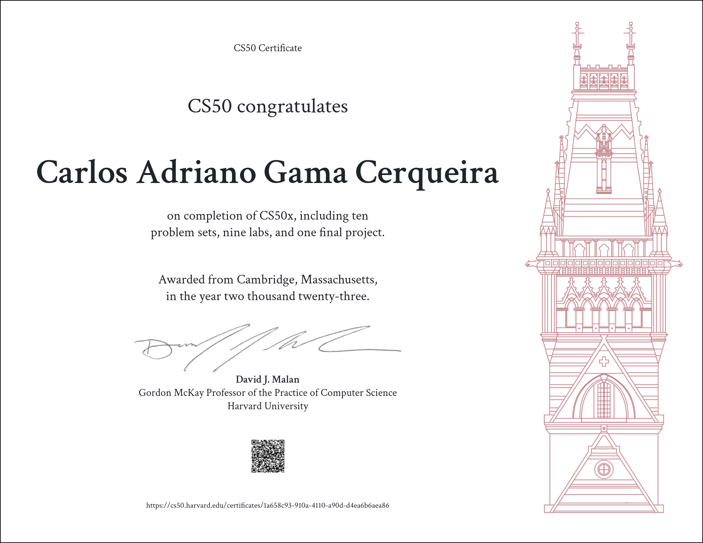

# CS50’s Introduction to Computer Science (2022)
Before reading the files in this repository, remember the commitment to [Academic Honesty](https://cs50.harvard.edu/x/2024/honesty/). Try to solve the problems on your own.

## Table of contents
  * [Scratch](https://scratch.mit.edu/projects/558180029/)
  * Week 1
    * [Hello](./week1/hello/hello.c)
    * [Population](./week1/population/population.c)
    * Mario [Less](./week1/mario/less/mario.c) or [More](./week1/mario/more/mario.c)
    * [Cash](./week1/cash/cash.c) or [Credit](./week1/credit/credit.c)
  * Week 2
    * [Scrabble](./week2/scrabble/scrabble.c)
    * [Readability](./week2/readability/readability.c)
    * [Caesar](./week2/caesar/caesar.c) or [Substitution](./week2/substitution/substitution.c)
  * Week 3
    * [Sort](./week3/sort/answers.txt)
    * [Plurality](./week3/plurality/plurality.c)
    * [Runoff](./week3/election/runoff/runoff.c) or [Tideman](./week3/election/tideman/tideman.c)
  * Week 4
    * [Volume](./week4/volume/volume.c)
    * Filter [Less](./week4/filter/less/helpers.c) or [More](./week4/filter/more/helpers.c)
    * [Recover](./week4/recover/recover.c)
  * Week 5
    * [Inheritance](./week5/inheritance/inheritance.c)
    * [Speller](./week5/speller/dictionary.c)
  * Week 6
    * [World Cup](./week6/tournament/tournament.py)
    * [Hello](./week6/sentimental-hello/hello.py)
    * Mario [Less](./week6/sentimental-mario/less/mario.py) or [More](./week6/sentimental-mario/more/mario.py)
    * [Cash](./week6/sentimental-cash/cash.py) or [Credit](./week6/sentimental-credit/credit.py)
    * [Readability](./week6/sentimental-readability/readability.py)
    * [DNA](./week6/dna/dna.py)
  * Week 7
    * [Songs](./week7/songs/)
    * [Movies](./week7/movies/)
    * [Fiftyville](./week7/fiftyville/)
  * Week 8
    * [Trivia](./week8/trivia)
    * [Homepage](./week8/homepage)
  * Week 9
    * [Birthdays](./week9/birthdays)
    * [Finance](./week9/finance)
  * [Final Project](https://github.com/biribas/kilo-text-editor)

## Certificate

